# [BE] Desafio Técnico - Stefanini

# 🚀 Documentação do Projeto: PeopleConnect API

## 1. Resumo do Projeto

O **PeopleConnect API** é uma aplicação de cadastro de pessoas projetada para ser robusta, escalável e segura. O projeto consiste em uma API RESTful desenvolvida em .NET 6+ e um front-end em React 17+. O sistema permitirá operações completas de CRUD (Cadastro, Alteração, Remoção e Consulta) para registros de pessoas.

Além das funcionalidades básicas, o projeto incorpora práticas modernas de desenvolvimento, como:

- **Versionamento de API**: Suporte para múltiplas versões da API (v1 e v2) para garantir a evolução do sistema sem quebrar integrações existentes.
- **Autenticação e Autorização**: Acesso seguro aos endpoints através de JSON Web Tokens (JWT).
- **Arquitetura Limpa (Clean Architecture)**: Uma estrutura de projeto que promove a separação de responsabilidades, testabilidade e manutenibilidade.
- **Testes Automatizados**: Cobertura de código de no mínimo 80% no back-end para garantir a qualidade e a confiabilidade.
- **Documentação de API**: Geração automática de documentação com Swagger/OpenAPI.
- **Deploy em Nuvem**: A aplicação será preparada para ser implantada em um ambiente de nuvem acessível.

## 2. Nome e Propósito do Projeto

- **Nome:** **PeopleConnect API**
- **Propósito (O porquê):** O objetivo principal deste projeto é construir uma solução de software que não apenas resolva o desafio técnico proposto, mas que também sirva como um portfólio de excelência técnica. Ele visa demonstrar proficiência nas tecnologias .NET e React, e na aplicação de padrões de arquitetura e engenharia de software de ponta, como Clean Architecture, testes automatizados e versionamento de API, que são cruciais para o desenvolvimento de aplicações enterprise-level.

## 3. Diagrama de Classes (Mermaid)

Este diagrama representa as principais entidades do domínio e suas relações


## 4. Diagrama de Entidade-Relacionamento (dbdiagram.io)

Este diagrama modela a estrutura do banco de dados, incluindo as tabelas, colunas, chaves primárias e estrangeiras.

```mermaid
erDiagram
    USERS {
        GUID id PK "Primary Key"
        string username UK "Unique"
        string password_hash "Hashed password"
        datetime created_at
        datetime updated_at
    }

    PERSONS {
        GUID id PK "Primary Key"
        string nome "Nome obrigatório"
        string sexo "Opcional"
        string email "Opcional, formato validado"
        date data_nascimento "Data de Nascimento obrigatória"
        string naturalidade "Opcional"
        string nacionalidade "Opcional"
        string cpf UK "CPF obrigatório, único"
        datetime created_at
        datetime updated_at
    }

    CONTACT_INFOS {
        GUID id PK
        string type "Tipo (Celular, Email, etc)"
        string value "Valor do contato"
        boolean is_primary "É o principal?"
        GUID person_id FK "Chave Estrangeira para PERSONS"
    }

    PERSONS ||--o{ CONTACT_INFOS : "has"
```



## 5. Arquitetura do Back-end

Para o back-end, adotaremos uma abordagem simplificada da **Clean Architecture** (Arquitetura Limpa), que organiza o projeto em camadas de responsabilidades, garantindo baixo acoplamento e alta coesão.

A regra fundamental é a **Regra de Dependência**: as dependências só podem apontar para dentro. Ou seja, a Infraestrutura depende da Aplicação, que por sua vez depende do Domínio.

1. **Domain (Domínio)**
    - **O que é?** O núcleo da aplicação. Contém as entidades de negócio (`Person`, `User`, `Address`), enums e regras de negócio que são independentes de tecnologia.
    - **Exemplo:** A classe `Person` e a lógica para validar se um CPF é válido residem aqui.
    - **Dependências:** Não depende de nenhuma outra camada.
2. **Application (Aplicação)**
    - **O que é?** Contém a lógica de negócio da aplicação (casos de uso). Orquestra o fluxo de dados, chamando o domínio para executar regras de negócio e utilizando interfaces para acessar a infraestrutura.
    - **Exemplo:** O caso de uso "Cadastrar Nova Pessoa", que recebe os dados, valida e usa uma interface de repositório (`IPersonRepository`) para persistir a pessoa.
    - **Dependências:** Depende apenas da camada de Domínio.
3. **Infrastructure (Infraestrutura)**
    - **O que é?** Contém as implementações das interfaces definidas na camada de Aplicação. É onde os detalhes técnicos (banco de dados, serviços externos, etc.) são implementados.
    - **Exemplo:** A implementação do `PersonRepository` usando o Entity Framework Core para se comunicar com o banco de dados. A geração de token JWT também reside aqui.
    - **Dependências:** Depende da camada de Aplicação.
4. **Presentation (Apresentação)**
    - **O que é?** O ponto de entrada da aplicação. No nosso caso, é o projeto **Web API**. Responsável por receber as requisições HTTP, chamar a camada de Aplicação para executar a ação e retornar a resposta.
    - **Exemplo:** O `PersonsController` com os endpoints `GET`, `POST`, `PUT`, `DELETE`.
    - **Dependências:** Depende da camada de Aplicação.

## 6. Estrutura de Pastas do Projeto

A estrutura de pastas refletirá a arquitetura definida, facilitando a navegação e a manutenção do código.

```markdown
/PeopleConnect/
├── PeopleConnect.sln
├── src/
│   ├── Core/
│   │   ├── PeopleConnect.Domain/
│   │   │   ├── Entities/ (Person.cs, User.cs, Address.cs)
│   │   │   └── Common/ (ValueObjects como CPF.cs, Email.cs)
│   │   └── PeopleConnect.Application/
│   │       ├── Features/ (Organizado por funcionalidade)
│   │       │   ├── Auth/
│   │       │   │   └── Commands/ (LoginUser/)
│   │       │   └── Persons/
│   │       │       ├── Commands/ (CreatePerson/, UpdatePerson/, DeletePerson/)
│   │       │       └── Queries/ (GetAllPersons/, GetPersonById/)
│   │       ├── Contracts/ (Interfaces para persistência e serviços)
│   │       │   ├── Persistence/ (IPersonRepository.cs)
│   │       │   └── Infrastructure/ (IJwtTokenGenerator.cs)
│   │       └── Dtos/ (PersonDto.cs, CreatePersonDto.cs)
│   ├── Infrastructure/
│   │   └── PeopleConnect.Infrastructure/
│   │       ├── Persistence/
│   │       │   ├── Repositories/ (PersonRepository.cs)
│   │       │   └── DataContext.cs
│   │       └── Auth/ (JwtTokenGenerator.cs)
│   └── Presentation/
│       └── PeopleConnect.Api/
│           ├── Controllers/
│           │   ├── v1/ (PersonsController.cs)
│           │   └── v2/ (PersonsController.cs)
│           ├── Middleware/ (GlobalExceptionHandler.cs)
│           └── Program.cs
└── tests/
    ├── PeopleConnect.Application.Tests/
    ├── PeopleConnect.Domain.Tests/
    └── PeopleConnect.Infrastructure.Tests/
```

## 7. Padrões de Projeto (Design Patterns)

- **Repository Pattern**:
    - **O que é?** Abstrai a lógica de acesso a dados. A camada de Aplicação usa uma interface (ex: `IPersonRepository`) e a camada de Infraestrutura a implementa com uma tecnologia específica (ex: EF Core).
    - **Por que usar?** Desacopla a lógica de negócio da tecnologia de banco de dados. Facilita a troca do SGBD no futuro e torna os testes unitários da camada de aplicação muito mais simples (usando mocks).
- **Mediator Pattern (com a biblioteca MediatR)**:
    - **O que é?** Promove um baixo acoplamento ao centralizar a comunicação entre objetos. Em nossa API, o Controller não chamará um serviço diretamente. Em vez disso, ele enviará um objeto de `Command` (para escrita) ou `Query` (para leitura) a um mediador, que encontrará o `Handler` correto para processar a requisição.
    - **Por que usar?** Mantém os controllers extremamente limpos e focados apenas em HTTP. Cada caso de uso (ex: criar pessoa) se torna uma classe pequena e focada (`CreatePersonCommandHandler`), seguindo o Princípio da Responsabilidade Única (SRP) e evitando "services" gigantes e complexos.
- **DTO (Data Transfer Object) Pattern**:
    - **O que é?** Utiliza objetos simples para transferir dados entre as camadas, especialmente entre a Aplicação e a API.
    - **Por que usar?** Evita o vazamento das entidades do domínio para o "mundo exterior". Permite formatar os dados de maneira específica para a necessidade do cliente (front-end), ocultando propriedades internas e prevenindo problemas de referências cíclicas na serialização.

## 8. Comunicação com o Banco de Dados

- **Tecnologia Escolhida:** **Entity Framework Core (EF Core)**
- **Justificativa:**
    - **Simplicidade e Produtividade:** EF Core é um ORM (Object-Relational Mapper) que abstrai a maior parte do código SQL repetitivo de operações CRUD. Ele permite que o desenvolvedor trabalhe com objetos C# diretamente, agilizando muito o desenvolvimento.
    - **Padrão de Mercado:** É a tecnologia de acesso a dados padrão e mais bem integrada ao ecossistema .NET, com vasto suporte da comunidade e da Microsoft.
    - **Flexibilidade de Provedor:** Será usado o H2