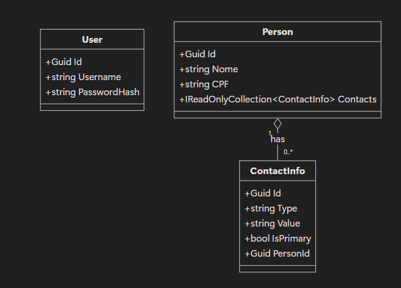
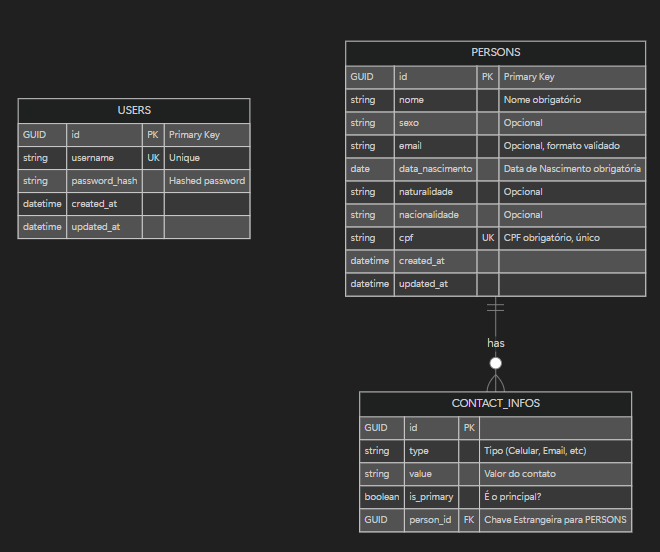

# PeopleConnect: Desafio Técnico Stefanini

## Visão Geral da Plataforma

O PeopleConnect foi concebido como uma plataforma de leads, projetada para que vendedores e equipes comerciais possam acessar uma base de contatos qualificados. A ideia central é que um usuário (vendedor) pague para se registrar e, com isso, ganhe acesso a uma lista de pessoas (leads) e suas informações de contato, potencializando suas oportunidades de negócio. A plataforma foi estruturada com um sistema de permissões claro, onde usuários pagantes são "Clientes" com acesso de leitura, e a gestão dos dados é centralizada em "Administradores".

## Análise Técnica do Projeto

### Backend (.NET)

#### 1\. Estrutura de Pastas

A estrutura do projeto backend segue uma organização clara e modular, alinhada com os princípios da Clean Architecture, separando as responsabilidades em camadas distintas:

```
/Backend/
├── 📄 PeopleConnect.sln
├── 📁 Domain/
│   ├── 📁 PeopleConnect.Domain/
│   │   ├── Entities/         # Classes de domínio (Person, User, ContactInfo)
│   │   └── Exceptions/       # Exceções de negócio customizadas
│   └── 📁 PeopleConnect.Domain.Tests/ # Testes unitários para a camada de domínio
├── 📁 Application/
│   ├── 📁 PeopleConnect.Application/
│   │   ├── Contracts/        # Interfaces (abstrações) para a infraestrutura
│   │   ├── Dtos/             # Objetos de transferência de dados
│   │   ├── Features/         # Casos de uso com MediatR (Commands e Queries)
│   │   └── Behaviors/        # Middlewares do MediatR (ex: validação)
│   └── 📁 PeopleConnect.Application.Tests/ # Testes unitários para a camada de aplicação
├── 📁 Infrastructure/
│   ├── 📁 PeopleConnect.Infrastructure/
│   │   ├── Auth/             # Implementação de JWT e Hashing de senhas
│   │   ├── Persistence/      # Implementação do Repositório com EF Core
│   │   └── Services/         # Serviços de infraestrutura (ex: CurrentUserService)
│   └── 📁 PeopleConnect.Infrastructure.Tests/ # Testes de integração para a infraestrutura
├── 📁 Presentation/
│   └── 📁 PeopleConnect.Api/
│       ├── Controllers/      # Controladores da API (v1)
│       ├── Middleware/       # Middleware de tratamento de exceções globais
│       └── Program.cs        # Configuração da aplicação (startup)
└── 📁 Tests/
    └── 📁 PeopleConnect.IntegrationTests/ # Testes de integração End-to-End
```

#### 2\. Arquitetura e Padrões Utilizados

O backend foi construído sobre uma base sólida de **Clean Architecture**, garantindo a separação de responsabilidades e a testabilidade do código. A regra de dependência é estritamente seguida, com as camadas externas (Presentation, Infrastructure) dependendo das camadas internas (Application, Domain).

  * **Diagrama de Arquitetura:**
    

  * **Diagrama de Entidade-Relacionamento (ER):**
    

**Principais Padrões e Tecnologias:**
  * **Repository Pattern:** Abstrai o acesso a dados. As interfaces de repositório (`IPersonRepository`, `IUserRepository`) são definidas na camada de Aplicação, enquanto a implementação concreta, usando **Entity Framework Core**, reside na camada de Infraestrutura.
  * **Validação com FluentValidation:** Cada `Command` possui um `Validator` associado, que é executado automaticamente por um `ValidationBehavior` no pipeline do MediatR, garantindo que os dados de entrada sejam válidos antes de chegar à lógica de negócio.
  * **Injeção de Dependência:** Utilizada extensivamente para gerenciar o ciclo de vida dos serviços, repositórios e outros componentes, promovendo baixo acoplamento.
  * **Autenticação JWT:** A segurança da API é garantida por JSON Web Tokens, com a lógica de geração e validação implementada na camada de Infraestrutura.
  * **Testes Automatizados (xUnit):** O projeto possui uma suíte de testes robusta, incluindo:
      * **Testes Unitários** para as camadas de Domínio e Aplicação.
      * **Testes de Integração** que utilizam **Testcontainers** para criar um banco de dados PostgreSQL isolado, garantindo que os testes não afetem o ambiente de desenvolvimento e simulem o ambiente de produção de forma fiel.

### Frontend (React)

#### 1\. Estrutura de Pastas

O frontend é uma Single Page Application (SPA) desenvolvida com Vite e React, com uma estrutura de pastas organizada por funcionalidade e responsabilidade.

```
/Frontend/
├── public/
├── src/
│   ├── components/
│   │   ├── common/           # Componentes de UI genéricos (Button, Spinner, etc.)
│   │   ├── forms/            # Componentes de formulário (InputField, SelectField)
│   │   └── modals/           # Componentes de modais (AddPerson, Details)
│   ├── hooks/                # Hooks customizados (ex: useAuth)
│   ├── pages/                # Componentes de página (Login, Register, Persons)
│   ├── services/             # Lógica de comunicação com a API (Axios)
│   ├── types/                # Definições de tipos TypeScript
│   ├── utils/                # Funções utilitárias (formatters, validators)
│   └── test/                 # Configuração e utilitários de teste
├── index.html
└── vite.config.ts
```

#### 2\. Arquitetura e Padrões Utilizados

A aplicação frontend foi projetada para ser moderna, reativa e de fácil manutenção.

  * **Gerenciamento de Estado com Context API:** O estado de autenticação global é gerenciado pelo `AuthContext` (`useAuth`), que provê informações do usuário e o token para toda a aplicação.
  * **Comunicação com API:** Centralizada em `src/services/api.ts`, utiliza **Axios** com `interceptors` configurados para adicionar automaticamente o token JWT nas requisições e para tratar erros de forma globalizada (ex: redirecionar para o login em caso de erro 401).
  * **Componentização:** A interface é dividida em componentes reutilizáveis e especializados, seguindo os princípios do React para criar uma UI declarativa e modular.
  * **Roteamento:** Utiliza **React Router Dom** para gerenciar a navegação entre as páginas e proteger rotas que exigem autenticação.
  * **Formulários:** Gerenciados com **React Hook Form** para controle de estado, validação e performance.
  * **Estilização com Tailwind CSS:** Adotado para um desenvolvimento de UI rápido e consistente, seguindo uma abordagem *utility-first*.
  * **Testes com Vitest e Testing Library:** O projeto possui uma base de testes unitários e de componentes que focam no comportamento da aplicação do ponto de vista do usuário.

-----

### O que foi pedido vs. O que foi feito

O projeto implementa com sucesso todos os requisitos fundamentais do desafio, e em muitos pontos, vai além, adotando soluções robustas e alinhadas com as melhores práticas do mercado.

  * **Back-end em .NET e Front-end em React:** Ambos foram desenvolvidos com versões recentes e estáveis das tecnologias (.NET 8 e React 18).
  * **Operações CRUD:** Todas as operações de cadastro, alteração, remoção e consulta foram implementadas e estão funcionais, com a devida proteção por autenticação e autorização.
  * **Validações:** Todas as validações obrigatórias e de formato (e-mail, CPF) foram implementadas tanto no frontend (para feedback rápido ao usuário) quanto no backend (para garantir a integridade dos dados).
  * **Documentação com Swagger:** A API possui documentação completa e interativa.
  * **Autenticação JWT:** Implementada e funcional, protegendo os endpoints da aplicação.
  * **Testes Automatizados:** O backend conta com uma cobertura de testes unitários e de integração superior a 80%, garantindo a confiabilidade do código.
  * **Deploy:** A aplicação foi totalmente conteinerizada com Docker, pronta para deploy em qualquer ambiente de nuvem.

A principal divergência em relação ao solicitado foi o uso do **PostgreSQL** em vez do banco de dados **H2**. Devido a instabilidades encontradas com o H2 no ambiente de desenvolvimento, optei pelo PostgreSQL. Esta é uma solução mais robusta, performática e amplamente utilizada em ambientes de produção, o que agrega ainda mais valor profissional ao projeto.

# Acessando a Aplicação PeopleConnect

Existem duas maneiras de aceder à aplicação: através dos links de deploy na nuvem ou executando o ambiente completo localmente com Docker.

## 1. Acesso via Links de Deploy (Render.com)

Esta é a forma mais rápida de visualizar o projeto.

* **Frontend (Aplicação Web):**
    * **URL:** `https://peopleconnect-app.onrender.com`
    * **O que faz:** Abre o site no seu navegador. É a interface principal para login, registo e visualização das pessoas.

* **Backend (API):**
    * **URL:** `https://peopleconnect-api.onrender.com`
    * **O que faz:** Este é o cérebro da aplicação. O frontend comunica com este endereço para obter e manipular os dados. Pode aceder a rotas como `/health` ou `/api/v1/persons` (requer autenticação) para ver o seu funcionamento.

# Usar usuário Admin já existente:
    * **Email:** `admin`
    * **Senha:** `admin123`

**Aviso: Demora no Primeiro Carregamento**

A API da aplicação está hospedada no plano gratuito do Render.com. Para economizar recursos, o serviço entra em modo de "sleep" (hibernação) após 15 minutos de inatividade.

Isso significa que a **primeira requisição** (como o primeiro login ou o primeiro carregamento da lista de pessoas) após este período pode demorar entre **30 a 60 segundos** para ser respondida. Durante este tempo, a aplicação parecerá estar a "carregar".

Este atraso inicial é um comportamento esperado. Após a API "acordar", as requisições seguintes serão rápidas.

## 2. Execução Local via Docker (Ambiente Completo)

Este método sobe toda a infraestrutura (Frontend, Backend e Banco de Dados) na sua máquina. É ideal para desenvolvimento e para garantir que tudo funciona de forma integrada.

### Pré-requisitos

* Docker e Docker Compose instalados e em execução.

### Passos para Executar

1.  **Clone o Repositório:**
    ```bash
    git clone [https://github.com/mathieux-dev/PeopleConnect.git](https://github.com/mathieux-dev/PeopleConnect.git)
    cd PeopleConnect
    ```

2.  **Suba os Contentores:** Na raiz do projeto, execute o seguinte comando. Ele irá construir as imagens e iniciar os três serviços (frontend, backend e postgres) de uma só vez.

    ```bash
    docker-compose up -d --build
    ```

### Acessando os Serviços Locais

Após executar o comando acima, os serviços estarão disponíveis nos seguintes endereços:

* **Aplicação Frontend:** [http://localhost:3000](http://localhost:3000)
* **API Backend:** [http://localhost:5001](http://localhost:5001) (Pode testar o endpoint de saúde em [http://localhost:5001/health](http://localhost:5001/health))
* **Banco de Dados (via PgAdmin):** [http://localhost:8080](http://localhost:8080)
    * **Email:** `admin`
    * **Senha:** `admin123`

### Para Parar a Aplicação

Para parar todos os contêineres, execute o seguinte comando na raiz do projeto:

```bash
docker-compose down
```
# 📊 Backend Coverage Report - PeopleConnect

> **Atualizado em:** 08 de Setembro de 2025

## 📈 Resumo

| Métrica | Valor | Status |
|---------|-------|--------|
| **Line Coverage** | **91.70%** | 🟢 Excelente |
| **Total de Testes** | 216 | ✅ Todos passando |
| **Duração** | 30.2s | - |

## TODO:
Existe um bug que ao atualizar a página em uma das principais rotas (/login, /register, /persons), ela retorna um 404 e só volta ao normal ao acessar a URL principal: https://peopleconnect-app.onrender.com/